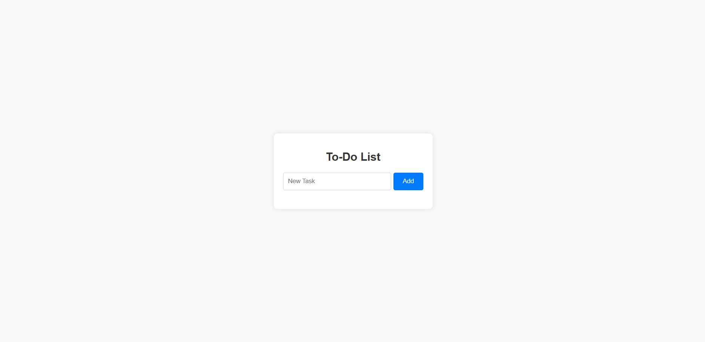

# ToDo List using NodeJs:

This is simple nodejs project, where you can create a todo list.

## How to Run:
To run this, 
- Install code editors from [Here](https://code.visualstudio.com/download)
- Install node from [Here](https://nodejs.org/en/download/prebuilt-installer/current) 
 
- Clone above repository in any folder 


- Open command prompt and run following command to install required node module
```https 
  npm install
``` 
- Run following command to run application
```https
  npm start

```

- Now you can check the output at port 4100. 
    [localhost:4100]

 

## Output :


### Feedback

If you have any feedback, please reach out to me at yogendrabaskota18@gmail.com 


